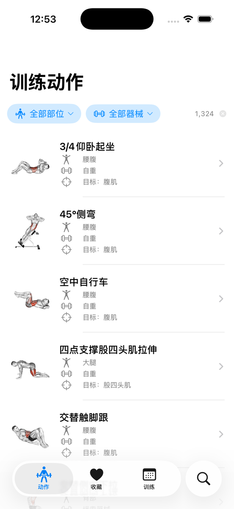
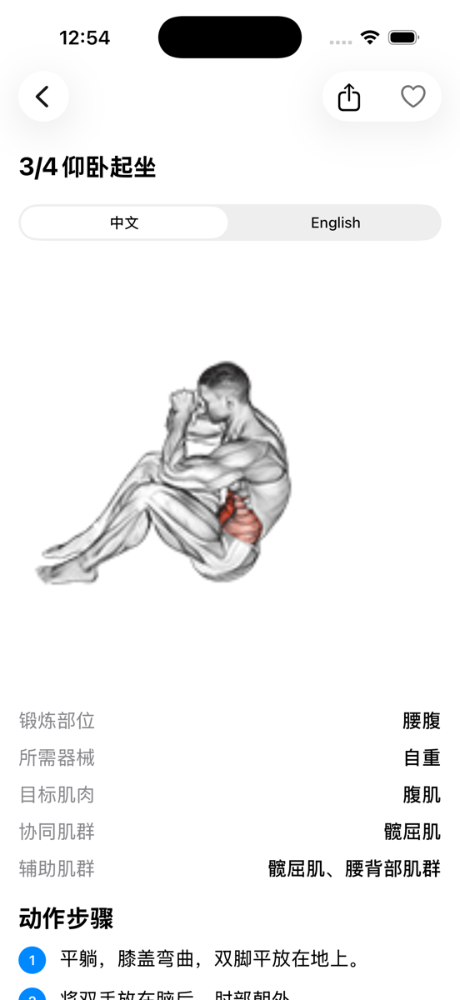
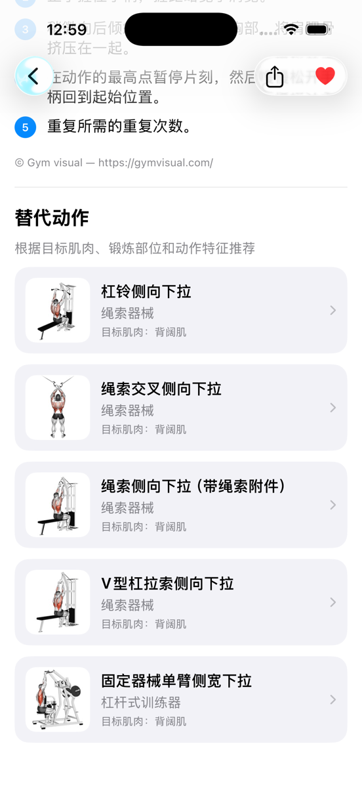
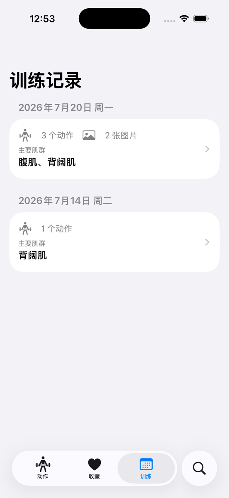

<p align="center">
  
</p>

<h1 align="center">FitS</h1>

<p align="center">
  <a href="README.md">简体中文</a> · <a href="README.en.md">English</a>
</p>

<p align="center">
  
  
  <a href="LICENSE"></a>
</p>

FitS 是一个使用 SwiftUI 构建的本地健身动作浏览和训练记录 App。它提供中英文动作信息、专业术语搜索、收藏、替代动作推荐，以及按日期组织的个人训练记录。

> FitS 仍处于原型阶段。动作说明和推荐仅供信息参考，不能替代医生、康复师或专业教练的意见。

## 功能

- 使用中英文名称、专业术语和常用别名搜索动作名称、器械、锻炼部位和目标肌群
- 按锻炼部位和器械筛选 1,324 个动作
- 查看动作动画、目标肌群、辅助肌群和中英文动作步骤
- 根据目标肌肉、锻炼部位和动作特征查看替代动作
- 收藏动作，并通过列表左滑快速收藏或加入今日训练
- 按日期记录训练动作、重量、次数和组数等自由文本备注
- 为一次训练添加图片，复制整次训练，或整体修改训练日期
- 将动作详情导出为长图并通过系统分享面板发送或保存

## 截图

| 动作浏览 | 动作详情 |
|:---:|:---:|
|  |  |
| **替代动作** | **训练记录** |
|  |  |

## 系统要求

- macOS 和 Xcode
- iOS 17 或更高版本的模拟器或设备

## 运行项目

```bash
git clone https://github.com/summerlyr/FitS.git
cd FitS
open ExerciseFinder.xcodeproj
```

在 Xcode 中选择 `ExerciseFinder` scheme 和一个 iOS 模拟器，然后运行。项目没有第三方包依赖。使用真机时，请在 Signing & Capabilities 中选择你自己的开发团队。

## 数据与隐私

FitS 不需要账户，当前也不向服务器上传训练数据。收藏、训练记录和训练图片保存在 App 的本地容器中；删除 App 会同时删除这些本地数据。

## 数据和媒体来源

动作元数据和多语言说明来自 [`hasaneyldrm/exercises-dataset`](https://github.com/hasaneyldrm/exercises-dataset)，并针对中文术语、动作名称和搜索体验做了调整。

动作图片和 GIF 为 **© Gym visual — https://gymvisual.com/**。这些媒体不属于本项目的 MIT License；公开仓库或署名本身不向下游使用者授予媒体许可。使用或再分发前，请查看 Gym visual 的条款，并根据自己的用途取得必要授权。

完整的第三方归属和许可说明见 [THIRD_PARTY_NOTICES.md](THIRD_PARTY_NOTICES.md)。

## 参与贡献

欢迎提交 Bug、翻译修正、搜索同义词和小范围功能改进。请先阅读 [CONTRIBUTING.md](CONTRIBUTING.md)。安全问题请按照 [SECURITY.md](SECURITY.md) 私下报告。

## License

FitS 的原创源代码使用 [MIT License](LICENSE)。第三方数据和媒体不因此重新授权，适用条款见 [THIRD_PARTY_NOTICES.md](THIRD_PARTY_NOTICES.md)。
